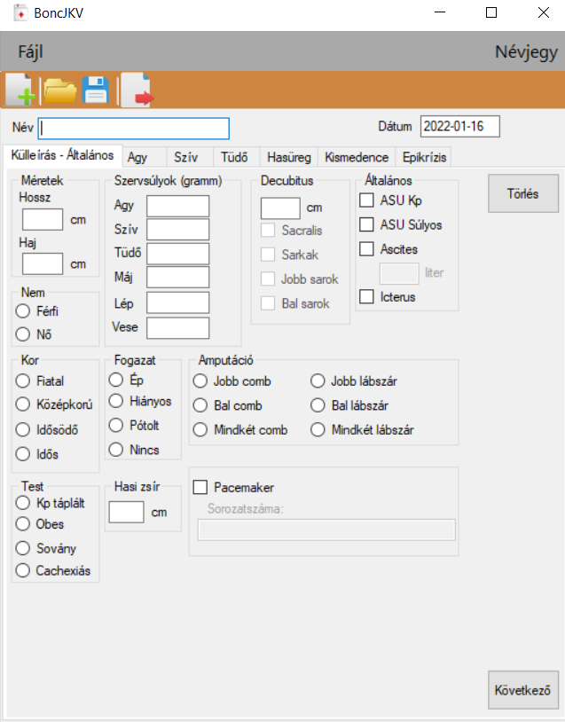

# BoncJKV

This is VB.NET application for practicing pathologists.
It helps creating the report of a postmortem examination.

Data can be submitted through a WinForms UI. After all input finished, you can export to a MS Word document.
Exported report use a template, which is updated according to the actual data.

It is also possible to save and load records. Previous examinations are stored in a XML file.

The user interface's language is Hungarian.

